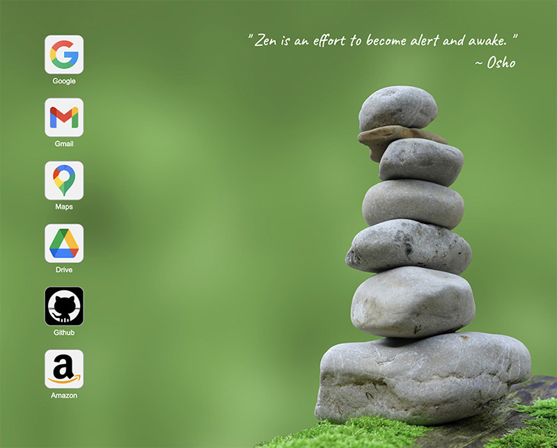

# browser-home
A very zen, uncluttered, customizable home page for your browser.



## Description
I got tired of the basic home pages that the main browsers give you. They always have something you don't want. I wanted something very uncluttered, simple and with a random inspiration.

This homepage has a full screen background selected at random from a customizable list with an inspirational quote. The links are just a list of icons in a vertical flex box along the left side. These too are customizable.
Everything is set via two JSON files. It is designed to reside locally on the file system but could be exapanded to read from a web server and database.

A live example can be viewed here: [Custom Browser Homepage Example](https://www.stevenlyles.net/playground/browser-home/home_local.html)

Just hit refresh to update the background and quote.

## Usage
To use, just clone this repo to a location on your local drive. Then set the homepage on your browser to point to it. With Chrome and Safari you can also set your new tab to open the local page, but Firefox will only let you set the homepage.

## Configuration
There are 2 JSON files used to set the customization.
1. backgrounds.json - set backgrounds, quotes, font colors, and quote position
2. config.json - set links and random quote lists.

### backgrounds.json
This file contains a JSON object that is assigned to a Javascript variable. The JSON is a list of configurations for the backgrounds that is as follows:
```angular2html
{ "i" :  0,
  "pathname"    : "./backgrounds/zen-stones-green.jpg",
  "quote_color" : "white",
  "desc_color"  : "white",
  "position"    : "top",
  "quote" : {
    "text" : "Zen teaches nothing; it merely enables us to wake up and become aware. It does not teach, it points.",
    "credit" : "D.T. Suzuki"
  }
}
```
| key         | Description                                                                 |
|-------------|-----------------------------------------------------------------------------|
| i           | That is not used be the code and is for human reading only.                 |
| pathname    | This is the pathname to the background image. Can be relative or url        |
| quote_color | Color of the quote text; select to suit the background                      |
| desc_color  | Color of text name of link icon; also select to best suit background        |
| position    | quotes are always on the right side and can be either top, middle or bottom |
| quote   | quote to use for this image with it's credit*                               |

*If the quote section is omitted the code will select a random quote from the config.json file.

### config.json
This file contains configuraiton for the links and list of random quotes. The links are just of list of configruations as follows:

```angular2html
{
  "link": "https://www.google.com",
  "icon": "./icons/google_icon.png",
  "desc": "Google"
}
```
These are pretty self-explanatory.

| Key        | Description |
|------------|-------|
| link | url to open when clicked |
| icon | icon to display for the link; used a default if left blank ("") |
| desc | Text name to display below the icon |


